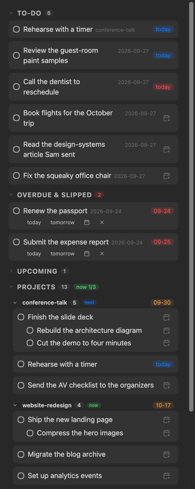
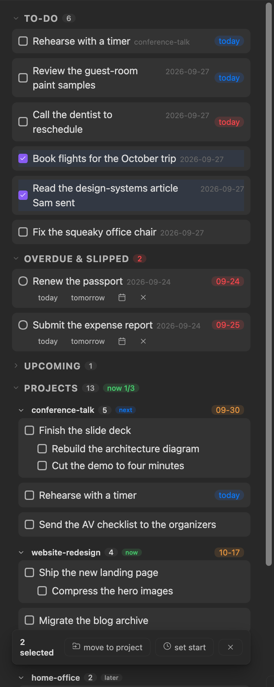
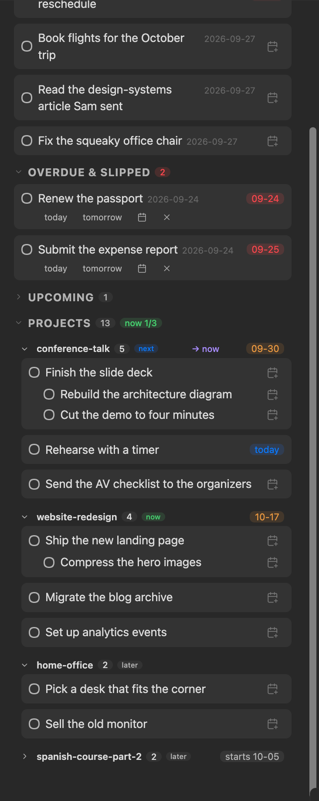

# Daily Task Panel

An Obsidian sidebar panel that turns daily-note capture into project execution. Your markdown is the database; the panel is a projection of it — Daily Task Panel keeps no task store of its own, mints no IDs, and edits a task line only when you act on it. Every action is a plain text edit you could have made yourself, and every panel action has an undo.



## Install

In Obsidian, open *Settings → Community plugins → Browse*, search for **Daily Task Panel**, then *Install* and *Enable*.

Other ways in:

- **BRAT**, for pre-release builds: install the [BRAT](https://github.com/TfTHacker/obsidian42-brat) plugin, then *Add beta plugin* → `SeanYHan888/obsidian-daily-task-panel`.
- **Manual**: download `main.js`, `manifest.json`, and `styles.css` from the [latest release](https://github.com/SeanYHan888/obsidian-daily-task-panel/releases), put them in `<your vault>/.obsidian/plugins/daily-task-panel/`, reload Obsidian, and enable Daily Task Panel in *Settings → Community plugins*.

**Requirements:** Obsidian 1.7.2+ and the [Tasks](https://github.com/obsidian-tasks-group/obsidian-tasks) plugin in its default emoji format. Daily Task Panel reads tasks through Tasks and completes them through its API, so done-dates, recurrence, and any downstream sync keep working. Without it, the panel tells you what's missing instead of rendering. Works on desktop and mobile.

## 60-second start

1. Install and enable **Tasks**, then **Daily Task Panel**. The panel opens in the right sidebar (or run the *Open panel* command).
2. Put `- [ ] try the panel ⏳ YYYY-MM-DD`, with today's date, in any note → it appears in **To-do**.
3. Enable the core **Daily Notes** plugin and add an `# Inbox` heading to today's note. Any task you jot under it shows up at the tail of To-do, waiting for triage.
4. When you're ready for projects: create a `Projects/Active` folder and give each project note a `status: now|next|later` frontmatter field. (Or skip this — Daily Task Panel works fine as a pure daily-note panel, and the Projects section will explain the workflow when you want it.)

## The model

Tasks are checkbox lines in the [Tasks emoji format](https://publish.obsidian.md/tasks/Reference/Task+Formats/Tasks+Emoji+Format):

- `⏳` **scheduled** — the day you *plan* to work on it. Slideable without guilt; the only date most tasks ever need.
- `📅` **due** — a real external deadline. Rare, and always a debt once it arrives.
- A task belongs to a project because its line lives in that project's note. No project tags.
- **Triage** means emptying the inbox: give each capture a date, a project, or a cancellation.

The panel is four projections of that model:

| Section | What's in it |
|---|---|
| **To-do** | Open tasks scheduled or due **today**, then your undated inbox captures — the day's list and its triage queue, one working surface. |
| **Overdue & slipped** | Tasks due before today, or scheduled before today. A repair queue, not a guilt list. |
| **Upcoming** | Tasks dated later, visible while they wait, so scheduling ahead never makes a task disappear. Collapsed by default. |
| **Projects** | The open tasks in each project note, grouped by project, paced by your pacing mode (below). |

Sections are disjoint views of one thing — the date on the line. Tasks never "move" between them except by date edits or the passage of days.

## Working the panel

**Rows.** The circle completes a task (through the Tasks API, so ✅ done-dates are written). Clicking the text jumps to the task's line in its note — `Cmd/Ctrl+click` opens in a new tab, middle-click too. **Right-click any row** (long-press on mobile) for everything at once: *Open note*, *Edit text*, *Complete task*, the **Start** and **Due** groups, *Move to project*, *Select multiple*, and *Cancel task*. Every visible button is a shortcut to something in that menu, never the only way to do it.

**Two dates, one chip.** A task has a **start** (⏳, the day it enters To-do, slideable without guilt) and, rarely, a **due** (📅, a real deadline). A row shows one chip, the date that matters next: the start while it is ahead, then the due once started, else the start. Click the chip (or the small calendar button on an undated row) to edit that field. The start menu reads *Today · Tomorrow · Weekend · Next week*, then *+1 day · +1 week* when there is a start to nudge, *Set / Change start date*, and *Clear start*; the due menu reads *Set / Change due date* and *Clear due*, no quick dates, since a deadline is picked, never guessed. A start chip is blue and a due chip orange; either turns red once its day has passed (a due, from its day on). The row menu edits whichever field the chip isn't showing.

**Repairing slipped tasks.** Rows in Overdue & slipped carry one-tap actions: *today*, *tomorrow*, pick a date, or cancel. *Start all today* in the section's `…` menu sweeps everything slipped onto today's list — the morning zero ritual. Re-dating an overdue task moves its deadline rather than stacking a new date beside the stale one.

**Drag and drop** (desktop). Drag any row onto the **To-do** section to schedule it today, onto **Upcoming** to pick a future date, or onto a **project** to move the line (with its subtasks) into that note. Only targets whose drop would actually do something light up.

**Bulk triage.** Choose *Select tasks* in the To-do or Projects `…` menu, or *Select multiple* on any row's menu to start with that task in hand — checkboxes appear across the working list and the backlogs. A bar at the panel's foot shows the count with *move to project* and *set start* (folded into one `…` on a narrow panel). `Esc` or the `✕` exits.



**Move to project** physically cuts the task lines — subtask children included — out of their source and appends them under your project note's `## Tasks` heading (configurable). Choose *+ New project* in the picker and Daily Task Panel creates the note for you, from your template if you set one, from a minimal built-in scaffold if not. **Send back to To-do** (on a backlog task's menu) is the inverse: the line returns to today's daily note under your inbox heading. The row menu also carries *Edit text* (the words change, dates and tags stay) and *Complete task*.

**Undo.** Every line edit — reschedules, cancels, moves, bulk sweeps — shows a notice with an *Undo* link, and the *Undo last panel action* command walks back through the session's last 50 actions. Undo verifies each line still reads what the action left before restoring it; anything you've edited since is skipped, never guessed at. A move is undone on both sides: the lines return to where they came from and leave the note they landed in.

## Projects and pacing

A project is a note in your projects folder with frontmatter:

```yaml
---
status: next        # now | next | later
start: 2026-08-19     # optional, ISO date — the project waits until then
deadline: 2026-08-26  # optional, ISO date
---
```

Fold a project group by clicking its header; `Cmd/Ctrl+click` (or middle-click) jumps to the note. Right-click the header (or the `…` button) for the lifecycle menu: rename, set status, set or clear the start and the deadline, and *Mark done / dropped & archive*, which stamps the terminal status and moves the note to your archive folder — task lines untouched, links intact.



**Pick your pacing** in settings:

- **Capacity** — a `now n/limit` badge counts projects in `now` against your work-in-progress limit. Red past the limit; warns, never blocks.
- **Deadlines** — projects carry deadline chips and sort soonest-first; the badge stays out of the way.

- **Hybrid** (default) — both signals, plus the **pressing loop**: when a project's deadline is within the attention window (7 days by default) but the project isn't in `now`, its header offers a one-tap **→ now** (on hover on desktop, always on mobile). Your calendar and your commitments disagree — one tap answers, ignoring it is also an answer. Promoting past your limit goes through, and the notice names it — from the button or the status menu alike: *"conference-talk → now — now is full (4/3)"*.

In every mode you can also arrange the list by hand: the project header's menu has Move to top / up / down / to bottom, or on desktop drag a header onto another (stored as an `order` number in the note's frontmatter), setting a project to `now` lifts it to the top, and the Backlogs menu's **Organize by status** regroups everything now → next → later. The same menu creates a project (*New project*) and folds or unfolds every group at once. A deadline that has arrived always leads.

**Starting later.** Give a project a `start` date (the header menu's *Set start date*) and it waits: until that day it sits folded at the tail of the list — below every ranked and unranked project, soonest start first — with a neutral `starts MM-DD` chip in place of its deadline chip, and it never presses, whatever its deadline. From the start day it opens, rejoins the list, and in hybrid mode presses for **→ now** — a project with a start presses from that day instead of from the attention window. Setting it to `now` starts it early by declaration. A start after the deadline is written as asked, with a notice naming the contradiction. This is how a long effort split into parts (week 1 → part 1, week 2 → part 2) shows one part at a time.

Switching modes is lossless: statuses, starts, and deadlines live in your notes' frontmatter, not in the plugin.

## Settings

| Setting | Meaning | Default |
|---|---|---|
| Daily notes folder | Where daily notes live when the core Daily Notes plugin is off — for reading the inbox and for *Send back to To-do* alike. While the plugin is on, its folder and date format are used | `Daily Notes` |
| Projects folder | Notes here are projects | `Projects/Active` |
| Archive folder | Where retired project notes go | `Projects/Archive` |
| Machine-managed note | Optional — see below | *(blank)* |
| Inbox heading | The daily-note heading that counts as capture (plain text match, any language) | `Inbox` |
| Project template | Optional note for *New project*; `{{title}}` and `{{date:YYYY-MM-DD}}` are filled in | *(built-in scaffold)* |
| Move-target heading | Where moved tasks land in a project note | `Tasks` |
| Project pacing | Capacity / Deadlines / Hybrid | Hybrid |
| Work-in-progress limit | Projects allowed in `now` before the badge warns | `3` |
| Deadline attention window | Days before a deadline that hybrid offers `→ now` (0 = on arrival). The fallback for projects without a `start` — those press from their start day instead | `7` |

**Machine-managed note:** if some tool rewrites a note in your vault on its own schedule (an Apple Reminders sync, for example), point this setting at it. Its dated reminders appear and nag like any task, its scheduled time-blocks stay hidden (they're calendar, not tasks), and its rows allow check-off only — so the next sync never clobbers a panel edit.

## Playing well with others

Daily Task Panel interoperates through shared markdown, not APIs:

- **Tasks** owns parsing and completion side effects — Daily Task Panel never invents its own task format.
- **Day Planner** owns time: daily-note `# Events:` sections are never read or written.
- **Kanban**: the move-target heading is configurable, so a project note that becomes a board keeps receiving triaged tasks.
- **Sync tools**: the machine-managed note setting is the generic contract for any note-rewriting tool.
- **Your vault's pace**: the panel does no background work. It reprojects only when a task or a project note changes, not when you type in any other note, and not at all while the panel is hidden. The plugin's code is about 120 kB.

## Upgrading from Taskflow

This plugin was called Taskflow until September 2026. The new name comes with a new plugin id, so it installs into a new folder. Enable Daily Task Panel first: on its first start it copies your Taskflow settings. Then disable Taskflow and delete its folder. Hotkeys you had bound to Taskflow's commands need binding again.

## Feedback

Bugs and ideas are welcome as [GitHub issues](https://github.com/SeanYHan888/obsidian-daily-task-panel/issues).

## Credits

Daily Task Panel (formerly Taskflow) began as a fork of [obsidian-checklist-plugin](https://github.com/delashum/obsidian-checklist-plugin) by delashum, whose minimalist card-list look it keeps. MIT licensed; original license retained.
